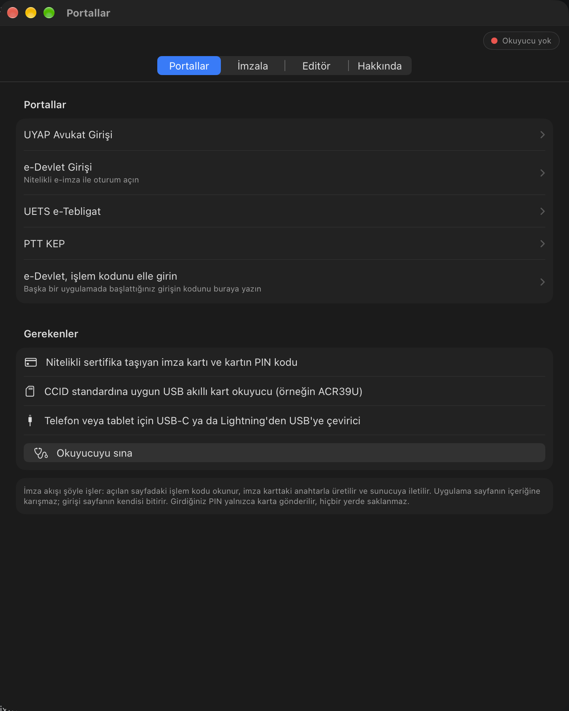
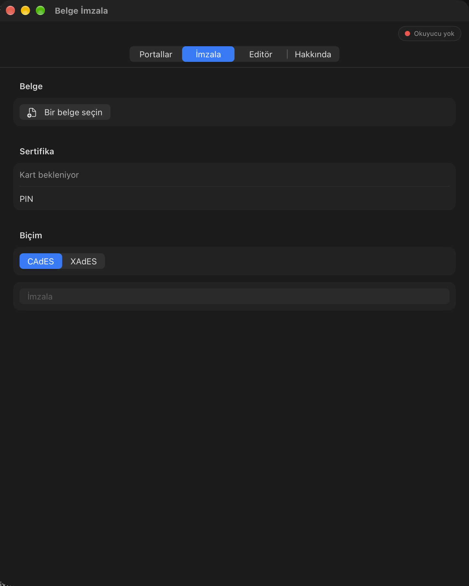
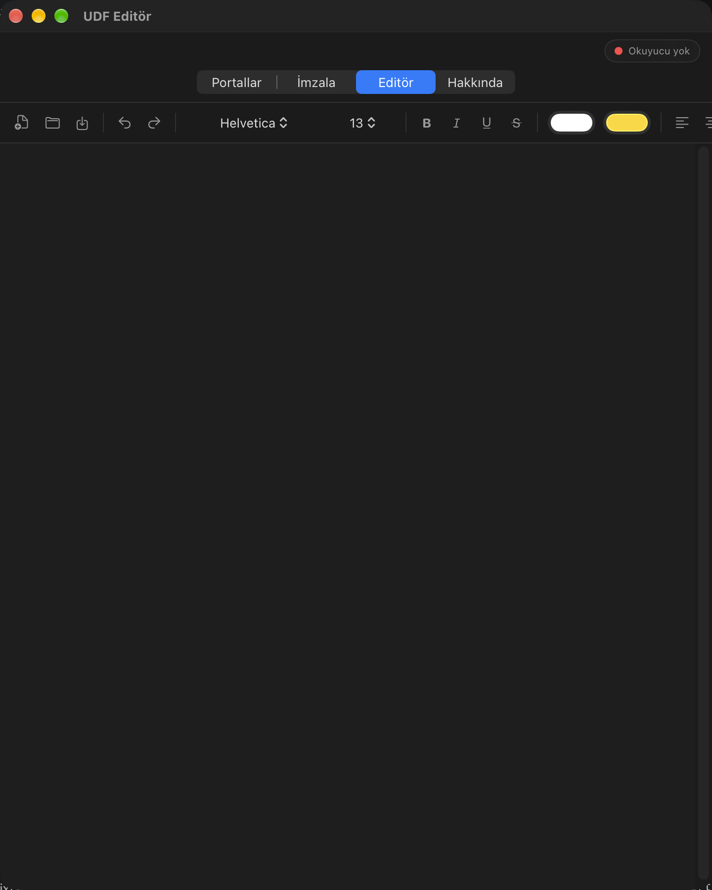

# USB E-imza & UDF

A native macOS, iOS and iPadOS application for two jobs: signing with a qualified electronic certificate on a USB smart card, and editing UDF documents. It connects Turkish e-government sign-in portals to a local signing service, produces CAdES and XAdES signatures, and reads, edits and writes UDF files without loss.


## Screens

<p align="center">
  <a href="docs/screenshots/portals.png"></a>
  <a href="docs/screenshots/sign.png"></a>
  <a href="docs/screenshots/editor.png"></a>
</p>
<p align="center">
  <sub>Portals &nbsp;·&nbsp; Document signing &nbsp;·&nbsp; UDF editor. Click a screen for the full image.</sub>
</p>

## Features

### Sign-in portals

- UYAP lawyer sign-in, e-Devlet, UETS e-Tebligat and PTT KEP open in an embedded WKWebView.
- A status badge shows the card state (ready, reading, no card, no reader) live.
- A reader probe checks the connected reader from the portals screen.

### Document signing

- Pick a local file, choose a certificate from the card, choose CAdES or XAdES, and enter the PIN.
- The signed output is exported as a file.

### UDF editor

- Text: font family and size, bold, italic, underline, strikethrough, superscript, subscript, text colour and highlight.
- Paragraphs: alignment, bulleted and numbered lists, indentation, line spacing and the document's named styles.
- Tables: insert a table, edit its cells, add or remove rows and columns. Merged cells (`columnSpan`, `rowSpan`) and borders are drawn and kept.
- Images: insert an inline image and resize it.
- Dynamic fields: province, unit name, date and page number.
- Page setup: paper size, orientation, margins, and header and footer text.
- Undo and redo.
- The reader and writer keep every structure of the file. XML the editor does not understand is carried through unchanged.

The same feature set runs on macOS, iOS and iPadOS from one codebase.

## Architecture

### Signing

The card private key never leaves the card. The PIN is verified and the RSA signature is computed on the card through ISO 7816-4 APDU commands (VERIFY, MSE SET, PSO COMPUTE DIGITAL SIGNATURE). The app reads certificates from the card's PKCS#15 structure and embeds the raw signature into a CMS (CAdES) or XML-DSig (XAdES) structure. Those structures are built with swift-asn1, so the same code runs on every platform. Card access uses CryptoTokenKit with a CCID reader.

A loopback HTTP server on `127.0.0.1:5975` exposes the signing service:

| Method | Path | Purpose |
| --- | --- | --- |
| `GET` | `/api/v1/signature/getCertificates` | List the certificates on the card |
| `POST` | `/api/v1/signature/sign` | Sign with a certificate and PIN |
| `GET` | `/api/v1/usb-stream` | Server-sent events with the card status |

The app injects a JavaScript shim into each portal page. The shim routes `fetch` and `EventSource` calls for the loopback port to the native host, so an HTTPS page reaches the local service without a mixed-content block. The PIN goes only to the card and is never stored.

### UDF

A UDF file is a ZIP archive that holds `content.xml`. The document keeps its text as one flat string, and every text run, table cell, field, header and footer references it by offset and length. The editor converts the document to an attributed string for TextKit and back. Tables travel through the text as one attachment with our own cross-platform renderer, so table editing works the same on every platform. Before a save, the text is rebuilt and every offset is recalculated.

## Signature formats

- **CAdES-BES:** a CMS `SignedData` structure, verifiable with `openssl cms -verify`.
- **XAdES-BES:** XML-DSig plus `SignedProperties`, canonicalized with libxml2 and verifiable with `xmlsec1 --verify`.

## Requirements

- A qualified electronic certificate on a smart card and its PIN.
- A CCID-compliant USB smart card reader (for example ACR39U).
- A USB-C or Lightning-to-USB adapter for a phone or tablet.
- macOS 13 or later, or iOS and iPadOS 16 or later.

## Project layout

| Path | Contents |
| --- | --- |
| `Sources/SignCore` | Platform-independent core: loopback server and router, CryptoTokenKit transport, PKCS#15 reader, card signer, CAdES and XAdES builders. |
| `Sources/SignCore/UDF` | UDF model, reader, writer, and the editor bridge (attributed text, tables, fields, page format). |
| `Sources/signbridged` | An executable that runs the signing service without the app. |
| `App/Sources` | The SwiftUI app: portals, document signing, the UDF editor and the about screen. |
| `Tests/SignCoreTests` | Tests for the envelope, router, APDU commands, PKCS#15 parsing, card signing, CAdES and XAdES output, and UDF round trips. |

## Build and test

Tools: `brew install xcodegen swiftlint swift-format xmlsec1`. The CAdES tests use `openssl`; the XAdES tests use `xmlsec1`.

```sh
swift build
swift test --no-parallel
```

Run the signing service without the app:

```sh
swift run signbridged
```

The Xcode project is generated from `project.yml`:

```sh
xcodegen generate
xcodebuild -project SignBridgeApp.xcodeproj -scheme SignBridgeApp \
  -destination 'platform=macOS' CODE_SIGNING_ALLOWED=NO build
xcodebuild -project SignBridgeApp.xcodeproj -scheme SignBridgeApp \
  -destination 'generic/platform=iOS' CODE_SIGNING_ALLOWED=NO build
```

Lint and format checks:

```sh
swiftlint lint --strict Sources App Tests
swift-format lint --recursive --parallel Sources App Tests
```

CI runs the build and tests, the lint checks, and the macOS and iOS app builds on every push and pull request.

## Dependencies

swift-asn1, swift-certificates, swift-crypto and ZIPFoundation. The signature structures are built with these libraries; the card key is never handed to them. XML canonicalization uses the system libxml2.
